# Slay the Spire 2 — Custom Character Mod (`sts2-mod`)

This private repository connects **Cloudtop** (where Jetski writes C# code, compiles against `sts2.dll`, runs static analyzers + xUnit tests, and packages the `.pck`) with your **Personal PC** (where Steam and *Slay the Spire 2* are installed for playtesting).

## Architecture & Workflow

```mermaid
flowchart LR
    subgraph pcInit["1. One-Time Setup on Personal PC"]
        copyDlls["Run scripts/copy-game-dlls.ps1\n(copies sts2.dll + 0Harmony.dll into lib/)"]
        pushDlls["git commit & git push"]
        copyDlls --> pushDlls
    end
    subgraph cloudtop["2. Cloudtop Dev Loop (Jetski)"]
        pullDlls["git pull (gets lib/sts2.dll)"]
        build["dotnet build + ModAnalyzers + xUnit"]
        pack["MegaDot 4.5.1 --headless --export-pack"]
        pushDist["Commit code + dist/<ModId>/ & git push"]
        pullDlls --> build --> pack --> pushDist
    end
    subgraph pcPlay["3. Playtest on Personal PC"]
        pullMod["git pull"]
        installMod["Run scripts/install-mod.ps1\n(copies dist/<ModId>/ -> Steam mods/)"]
        launch["Launch Slay the Spire 2"]
        pullMod --> installMod --> launch
    end
    pushDlls --> pullDlls
    pushDist --> pullMod
```



---

## Quick Start on Your Personal PC (Windows PowerShell)

### Step 1: Clone this repo on your Personal PC
```powershell
git clone https://github.com/amattapalli/sts2-mod.git
cd sts2-mod
```

### Step 2: One-time (and after major STS2 patches) — Provide game reference DLLs to Cloudtop
So Jetski can compile, decompile, and run automated tests directly on Cloudtop without needing Steam installed on Cloudtop, run:
```powershell
.\scripts\copy-game-dlls.ps1
git add lib/
git commit -m "chore: update sts2 reference dlls"
git push
```
*(Because this repository is **private**, storing `lib/sts2.dll` and `lib/0Harmony.dll` here is safe and lets Cloudtop build and package everything for you.)*

### Step 3: Pull & Playtest on Your Personal PC
Whenever Jetski pushes a new build on Cloudtop, run on your Personal PC:
```powershell
git pull
.\scripts\install-mod.ps1
```
This copies the pre-built `dist/<ModId>/` folder (`<ModId>.dll`, `<ModId>.pck`, `<ModId>.json`) straight into your Steam `Slay the Spire 2\mods\` directory—**you don't even need .NET or MegaDot installed on your Personal PC** unless you want to build locally.

---

## Docs
- [Modding Toolchain & Architecture Research](docs/sts2_character_mod_research.md)
- [Character Style & Gimmick Brainstorm](docs/sts2_character_brainstorm.md)
