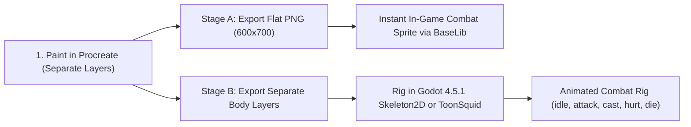

# The Transmuter — Procreate Art & Game Balancing Guide

This guide covers everything you need for **creating custom card/character artwork in Procreate** and **evaluating game design & balance** while playtesting **The Transmuter** in *Slay the Spire 2*.

---

## Part 1: Procreate Art & Character Design Guidelines

In *Slay the Spire 2*, card frames, borders, energy icons, and rarity banners are rendered dynamically by the game engine. Your artwork only needs to be exported as flat `.png` files using the **sRGB** color profile.

### 1. Procreate Canvas Size Cheat Sheet

| Asset Type | Repo Folder ([`Transmuter/images/`](file:///usr/local/google/home/amattapalli/PersonalProjects/sts2-mod/Transmuter/Transmuter/images)) | Procreate Canvas Size | Downscaled Game Size | Format & Framing Notes |
| :--- | :--- | :--- | :--- | :--- |
| **Card Portrait** | `card_portraits/big/` | **`1000 × 760 px`** | `250 × 190 px` (`4:1`) | Opaque background. Keep the main focal subject centered and slightly away from the top-left corner (where the Energy cost icon overlaps). |
| **Relic Icon** | `relics/big/` | **`256 × 256 px`** | `94 × 94 px` | **Transparent background.** Leave a `~20 px` padding border around the edges so the relic doesn't clip in the top bar. |
| **Power / Reagent Icon** | `powers/big/` | **`256 × 256 px`** | `64 × 64 px` | **Transparent background.** Use thick outlines, simple shapes, and high contrast so it reads clearly at `64×64` under an enemy's HP bar. |
| **Potion Icon** | `potions/` | **`256 × 256 px`** | `256 × 256 px` | **Transparent background.** |
| **Character Combat Sprite** | `charui/` | **`600 × 700 px`** | — | **Transparent background.** Leave `~40 px` padding at the bottom (feet) and top (head/intent marker). |
| **Character Select Splash** | `charui/select/` | **`1200 × 1110 px`** | — | Full atmospheric background illustration for the character select screen; place The Transmuter slightly right-of-center so the left-side UI text doesn't cover them. |
| **Multiplayer Hands** | `charui/hands/` | **`422 × 1200 px`** | — | **Transparent background.** Optional pointing / rock / paper / scissors hands for co-op mode. |

> [!TIP]
> **Draw Once at High Resolution:** You only ever need to paint the high-res canvas (`1000 × 760 px` for cards, `256 × 256 px` for powers/relics). When you drop your PNGs into the repo, we can run a single script to automatically downscale the `250 × 190 px` / `64 × 64 px` / `94 × 94 px` versions and wire them into C#.

---

### 2. Visual Readability & Color-Coding Tips for Card Art

In fast-paced deckbuilders, players recognize cards in their hand by **color palette and silhouette** before reading the title:
- **Color-Code by Reagent:**
  - **Sulfur Cards** (*Brimstone Toss*, *Calcination*, *Chain Detonation*): Warm **amber, fiery orange, and brimstone yellow** highlights.
  - **Mercury Cards** (*Cinnabar Slash*, *Quicksilver Needle*, *Sublimate*): Cool **liquid silver, cyan, and toxic violet** highlights.
  - **Salt Cards** (*Saline Solution*, *Halite Bash*, *Salt Ward*): Crisp **crystalline white, pale teal, and bone** highlights.
  - **Catalyst / Magnum Opus Cards** (*Hermetic Seal*, *The Magnum Opus*, *Philosopher's Engine*): **Alchemical gold and emerald green** combining all three hues.
- **Keep Backgrounds Simple:** Card portraits shrink to `250 × 190 px` in your hand. A dark, moody laboratory or vignette background makes the foreground weapon/vial/explosion pop.

---

### 3. Designing the Character Model (Staged Approach)

You can bring **The Transmuter** to life in two stages without redoing your artwork:

1. **Draw on Separate Layers from Day 1:**
   Even if you start with a static sprite, keep these on separate Procreate layers:
   - `Head_And_Mask` (plague doctor beak/goggles)
   - `Front_Arm_And_Flask` (the throwing/casting arm)
   - `Torso_And_Bandolier` (chest with glowing reagent vials)
   - `Back_Arm`
   - `Coat_Tails` / `Cape`
   - `Legs`
2. **Stage A (Static In-Game Sprite — 100% Procreate):**
   Export the merged character as a transparent PNG (`600 × 700 px`). In [`Transmuter.cs`](file:///usr/local/google/home/amattapalli/PersonalProjects/sts2-mod/Transmuter/TransmuterCode/Character/Transmuter.cs), `BaseLib`'s `NodeFactory<NCreatureVisuals>.CreateFromResource(...)` loads that single PNG directly into combat.
3. **Stage B (2D Paper-Doll Animation Later):**
   When you're ready for idle breathing and attack lunges, export each layer as a separate PNG and animate them using either:
   - **Godot 4.5.1 / MegaDot Built-in 2D Animator (Free):** Rig bones with `Skeleton2D` + `AnimationPlayer` using the standard animation names (`idle`, `attack`, `cast`, `hurt`, `die`).
   - **ToonSquid ($10 on iPad) or Procreate Dreams ($20 on iPad):** Animate directly with the Apple Pencil and export sprite sheets.

---

## Part 2: Game Design & Balancing Guide for *Slay the Spire 2*

If you are new to deckbuilder design, the secret is that *Slay the Spire* balancing revolves around **energy efficiency**, **combo reliability**, and **how a deck answers the three Acts**.

### 1. The "1 Energy" Yardstick (Baseline Math)

Every card you design costs **two resources**: **Energy** and **1 Card Draw** (the slot it took up in your 5-card hand). Use vanilla *Slay the Spire* numbers as your baseline yardstick for **1 Energy**:

| Rarity / Tier | 1-Energy Damage Baseline | 1-Energy Block Baseline | How Reagents Fit Into the Budget |
| :--- | :--- | :--- | :--- |
| **Basic Starter** | `6 Damage` (*Strike*) | `5 Block` (*Defend*) | A 1-Energy starter reagent card (*Brimstone Toss*, *Saline Solution*) trades a little immediate output (`4 Dmg` or `4 Block`) for `3 Reagent stacks` that pay off for `+9 to +12` value when reacted. |
| **Common** | `8–10 Damage` | `7–9 Block` | Common cards are your Act 1 bread-and-butter. They should provide `~6–8` immediate damage/block **plus** `2–4` Reagent stacks. |
| **Uncommon** | `11–14 Conditional` | `10–13 Conditional` | Build-around engines, AoE, and multi-reagent manipulators (*Sublimate*, *Volatile Flask*, *Athanor Furnace*). |
| **Rare** | `16+` or Rule-Breaker | `15+` or Rule-Breaker | Run-defining win conditions (*The Magnum Opus*, *Philosopher's Engine*, *Universal Solvent*). |

---

### 2. Avoiding the "Two-Card Combo Trap" (Floor vs. Ceiling)

The biggest risk when designing a combo character like **The Transmuter** is **drawing only half of your combo**:
- Imagine an enemy is attacking you for `18` damage, and your hand has 3 cards that *only* apply **Sulfur** and do `0` block and `0` immediate damage. Because Sulfur + Sulfur doesn't react by default, your turn would feel completely dead!
- **How to prevent this (Floor vs. Ceiling Design):**
  1. **Every Common card needs a "Floor":** Even if you don't trigger a Reaction this turn, playing *Cinnabar Slash* still deals `7` damage, and playing *Salt Ward* still gives `7` Block. The Reagent is the upside (**Ceiling**), not the only thing the card does.
  2. **Include "Bridge" & "Self-React" Cards:** Cards like *Quick Primer* (0-cost, applies both Sulfur & Mercury), *Volatile Flask* (AoE Sulfur + Salt), and *Calcination* (forces existing Sulfur to self-detonate without needing Mercury) ensure you never get stuck with unreactable stacks.

---

### 3. The 3 Questions Every Run Asks (Act 1 vs. Act 2 vs. Act 3)

In *Slay the Spire*, each Act tests a completely different dimension of your character's card pool:

| Stage of Run | The Question the Game Asks | How The Transmuter Answers It | What to Watch in Playtesting |
| :--- | :--- | :--- | :--- |
| **Act 1 (Elites)** | *"Can you deal 80–100 frontloaded damage in 3–4 turns before the Elite kills you?"* | **Detonate (`Sulfur + Mercury`)**: Fast single-target burst (`3×` combined stacks) + **Vulnerable**. | Are you taking 30+ damage in Act 1 hallway fights because setup takes 2 turns instead of 1? |
| **Act 2 (Multi-Enemy Fights)** | *"Can you survive 25+ incoming damage on Turn 1–2 while clearing multiple enemies?"* | **Calcify (`Sulfur + Salt`)** for AoE damage + **Dissolve (`Mercury + Salt`)** for Weak + Block, plus *Fume Cloud* / *Volatile Flask*. | Do Reagents feel awkward when switching targets between 3 enemies? (Is *Ouroboros Ring* / *Chain Detonation* enough?) |
| **Act 3 & Bosses** | *"Does your deck scale exponentially over 8–12 turns against 300–500 HP bosses?"* | **Stabilize (`StabilizedPower`)** to stack huge Reagents without prematurely popping them, then **Magnum Opus (`Sulfur + Mercury + Salt`)** for `4×` damage + `2×` Block + Energy/Draw. | Does **Magnum Opus** feel rewarding enough to justify holding back 1-on-1 reactions with **Stabilize**? |

---

### 4. Designing Satisfying Card Upgrades (`+`)

When you rest at a campfire and choose **Smith**, an upgrade should feel exciting, not mandatory or invisible:
- **Damage/Block Commons:** Aim for **~25–35% boost** (`7 -> 10` damage, or adding `+1` Reagent stack so a single card hits a bigger reaction).
- **Build-Around Uncommons/Rares:** The most fun upgrades change *how* a turn plays out—reducing Energy cost (`2 -> 1` on *The Magnum Opus*, `1 -> 0` on *Hermetic Seal*) or increasing the number of triggers (*Emerald Tablet* triggering the first **2** reactions each turn instead of 1).

---

### 5. Playtesting Checklist for Your First 3 Runs

When you pull and launch the mod on your PC, keep a quick mental note (or jot down bullets) on these 5 questions so we can tune the numbers together:

1. **Starter Deck Pace (Floors 1–5):** Does pairing *Brimstone Toss* (`Sulfur`) + *Saline Solution* (`Salt`) + *Cracked Alembic* (`2 random Reagent on Turn 1`) trigger a Reaction on Turn 1 or Turn 2 consistently, or does it feel too slow?
2. **Reaction Multipliers (`ReactionEngine.cs`):**
   - **Detonate (`Sulfur + Mercury`):** Currently `3× (Sulfur + Mercury)` single-target damage + `1` Vulnerable. Too strong or too weak?
   - **Calcify (`Sulfur + Salt`):** Currently `2× (Sulfur + Salt)` AoE damage + player gains Block equal to `Salt`.
   - **Dissolve (`Mercury + Salt`):** Currently `2` Weak + player gains `2× (Mercury + Salt)` Block.
   - **Magnum Opus (`Sulfur + Mercury + Salt`):** Currently `4× Total` damage + `2× Total` Block + `2` Vulnerable + `2` Weak + `1` Energy + `1` Card Draw.
3. **Stabilize Window:** Is `1 turn` of **Stabilize** (from *Hermetic Seal*) enough time to set up all 3 Reagents for **Magnum Opus**, or should *Hermetic Seal+* grant `2 turns` (or Retain)?
4. **Standout vs. Skipped Cards:** Which card rewards made you immediately click them, and which ones did you always skip?
5. **Energy & Card Draw Economy:** Did you frequently run out of cards in hand with leftover Energy, or run out of Energy with a full hand?

---

### 6. Balance Consideration: Mercury Damage Interaction (Secondary Proc vs. Flat Attack Modifier)

- **Current Behavior:** Mercury acts as a **secondary follow-up damage proc** via `AfterDamageReceived` (`Amount` unpowered damage per powered Attack). The card itself displays its base damage (`6`), followed by a separate damage tick on the enemy.
- **Alternative Considered (Flat Attack Modifier):** Modifying incoming attack damage directly (displaying a dynamic green `6 -> 6 + n` forecast when hovering over the target).
- **Decision:** **Keep as secondary proc for now.** Flat damage amplification risks scaling multi-hit attacks (*Quicksilver Needle*) and high-frequency attacks too aggressively (acting like target-based Strength), making Mercury disproportionately powerful compared to Salt and Sulfur. Keeping it as a separate follow-up trigger keeps the baseline power budget in check while preserving its alchemical identity.
