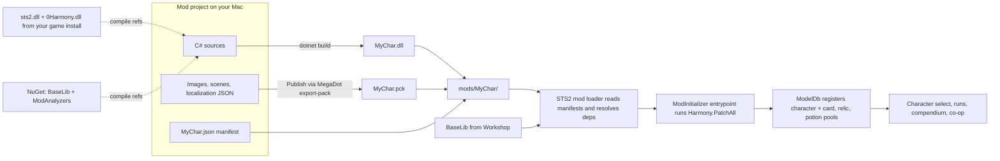

# Slay the Spire 2: Building a Custom Character Mod

> [!NOTE]
> Research snapshot from 2026-10-06. Sources: Alchyr's ModTemplate wiki (updated 2026-10-04), BaseLib v3.4.7 (released 2026-09-11), and two open-source character mods, The Engineer (updated 2026-10-04) and The Cursed (updated 2026-07-05). STS2 has been in Early Access since 2026-03-05, so expect things to keep changing.

## TL;DR

- **Modding is officially supported.** STS2 has a built-in mod loader (a `mods/` folder plus a `[ModInitializer]` entrypoint), Steam Workshop support, and an official uploader from Mega Crit.
- **The stack:** C# on .NET 9, running on **MegaDot** (Mega Crit's fork of Godot 4.5.1). On top of that you use **BaseLib** (the community content framework), **Harmony** (ships with the game), and Alchyr's `dotnet new` **character template**.
- **A mod is 3 files:** `ModId.json` (manifest), `ModId.dll` (code), and `ModId.pck` (art, scenes, and localization).
- **You compile against your own install's `sts2.dll`.** There's no public SDK package, so you build and test on the machine where the game is installed.
- **Start with placeholder visuals.** `PlaceholderCharacterModel` borrows Ironclad's visuals, so you can playtest cards and mechanics on day 1 and add your own art later.

## How a mod gets from your IDE into the game



## Toolchain (macOS)

| Need | What | How |
|---|---|---|
| Game | Slay the Spire 2 (Steam app `2868840`) | Provides `sts2.dll` and `0Harmony.dll` to compile against. It's also where you test. |
| Compiler | .NET SDK 9+ | [dotnet.microsoft.com](https://dotnet.microsoft.com/en-us/download) |
| Engine (for `.pck` export) | MegaDot 4.5.1 | `curl -fsSL https://megadot.megacrit.com/install.sh \| sh`. The game won't load a `.pck` exported by a newer Godot. |
| Framework | BaseLib v3.4.7 | Subscribe on the Workshop (id `3737335127`) or use a [GitHub release](https://github.com/Alchyr/BaseLib-StS2/releases). For compiling, use the NuGet package `Alchyr.Sts2.BaseLib`. |
| Scaffolding | Alchyr templates | `dotnet new install Alchyr.Sts2.Templates`, then `dotnet new alchyrsts2charmod --ModAuthor <you> -o <ModName>` (no spaces or underscores in the name) |
| IDE | Rider (recommended, free for non-commercial use) | The guides, the "Custom Card" file template, and the localization quick-fix all assume Rider. VS Code with the CLI also works. |
| Reading game code | Rider's decompiler or ILSpy on `sts2.dll` | The best way to learn: find a base-game card that does something similar and copy the commands it uses. |
| Reading game assets/text | [GDRE Tools](https://github.com/GDRETools/gdsdecomp) on `SlayTheSpire2.pck` | Lets you browse the base game's `localization/`, images, and scenes. |

## What the character template generates

```text
MyChar/
├── MyChar.json                 # manifest: id, version, min_game_version, deps [BaseLib], affects_gameplay
├── MyChar.csproj               # refs sts2.dll + 0Harmony.dll from the install; BaseLib + ModAnalyzers via NuGet
├── Directory.Build.props       # GodotPath -> MegaDot binary; optional Sts2Path override
├── project.godot, export_presets.cfg   # used by MegaDot to export the .pck
├── MyCharCode/                 # -> MyChar.dll
│   ├── MainFile.cs             # [ModInitializer] -> Harmony.PatchAll(assembly)
│   ├── Character/MyChar.cs     # HP, gold, starting deck/relics, pools, visual overrides
│   ├── Character/MyCharCardPool.cs     # card frame color (HSV) or custom frame, energy icons
│   ├── Character/MyCharRelicPool.cs, MyCharPotionPool.cs
│   ├── Cards/MyCharCard.cs     # [Pool(typeof(MyCharCardPool))] base: every subclass auto-joins your pool
│   └── Relics/, Powers/, Potions/      # same pattern
└── MyChar/                     # -> MyChar.pck, mounted at res://MyChar/
    ├── images/card_portraits/big/<snake_case>.png   # 1000x760 (606x852 full art)
    ├── images/charui/*.png     # char select, map marker, top-panel icon, energy icons
    └── localization/eng/{characters,cards,relics,powers,card_keywords,ancients,...}.json
```

## Anatomy of a character

### Gameplay definition (C#)

- `StartingHp`, `StartingGold` (default 99), `Gender`, `NameColor`, `StartingDeck`, `StartingRelics`, `CardPool`, `RelicPool`, `PotionPool`, and optionally `BaseOrbSlotCount`.
- The card pool controls the card frame color (an HSV shader over the base frame, or your own frame texture), the energy icons, and the deck-entry color.
- BaseLib automatically prefixes IDs (for example `MYCHAR-SPARK_BOLT`), so your content won't collide with other mods.

### Visual checklist (all of it can start as placeholders)

| Asset | Notes |
|---|---|
| Combat body | An `NCreatureVisuals` scene. It needs `Visuals` and `Bounds`. If BaseLib converts the scene, it works out `IntentPos`, `CenterPos`, `OrbPos`, and `TalkPos` for you. Options, from simplest to most work: a static PNG, then a Godot `AnimationPlayer`/`AnimationTree` (BaseLib automatically maps `idle`, `attack`, `cast`, `hurt`, and `die`), then Spine. |
| Character select | Background scene, button icon and locked icon, transition material, select SFX |
| HUD | Energy counter scene, top-panel icon, map marker, card-trail VFX |
| Other scenes | Rest-site animation, merchant animation |
| Co-op | Multiplayer hand textures (point / rock / paper / scissors), map icon outline |
| Audio | Attack, cast, and death SFX (FMOD event paths) |
| Card art | 1000x760 big portrait. A 250x190 small version and beta art are optional. If a card has no art, the template falls back to `card.png`. |

### Text (`MyChar/localization/eng/*.json`)

- `characters.json`: name, description, pronouns, banter lines, gold and death-prevention monologues.
- `cards.json`, `relics.json`, `powers.json`, `card_keywords.json`, `potions.json`, `static_hover_tips.json`.
- `ancients.json`: **you must include an Architect dialogue, or the character can't finish a run.**
- The ModAnalyzers package flags missing keys and can generate stubs (Alt+Enter, then "Generate localization").

## Anatomy of a card

Everything is a **Model** (`CardModel`, `RelicModel`, `PowerModel`, and so on) that overrides **lifecycle hooks** (`OnPlay`, `OnUpgrade`, `AfterCardPlayed`, `AfterSideTurnStart`, `AfterTurnEnd`, `AfterCardDrawn`, ...). Hooks do their work by running **commands** (`DamageCmd.Attack`, `CreatureCmd.GainBlock`, `PowerCmd.Apply<T>`, `OrbCmd.Channel<T>`, ...). The wiki's first rule is to use commands instead of changing state directly.

```csharp
// Adapted from The Engineer's BigDrill.cs. It inherits the template's MyCharCard,
// so it joins the character's card pool automatically.
public class SparkBolt() : MyCharCard(1, CardType.Attack, CardRarity.Common, TargetType.AnyEnemy)
{
    protected override IEnumerable<DynamicVar> CanonicalVars => [new DamageVar(8, ValueProp.Move)];

    protected override async Task OnPlay(PlayerChoiceContext choiceContext, CardPlay play)
    {
        await CommonActions.CardAttack(this, play).Execute(choiceContext);
    }

    protected override void OnUpgrade() => DynamicVars.Damage.UpgradeValueBy(3);
}
```

```json
{
  "MYCHAR-SPARK_BOLT.title": "Spark Bolt",
  "MYCHAR-SPARK_BOLT.description": "Deal {Damage:diff()} damage."
}
```

## Gimmick design space

### Mechanics the base roster already owns (don't clone these)

| Character | Core identity |
|---|---|
| Ironclad | Strength scaling, Exhaust, turning Block into damage |
| Silent | Poison, Shivs, Sly (a Sly card plays itself when discarded) |
| Defect | Orbs and Focus, Channel/Evoke |
| Regent | Stars (a secondary resource that carries over between turns), Forge |
| Necrobinder | Osty (a summon with its own HP), Doom (execute), Souls (0-cost draw tokens) |

Mega Crit's EA roadmap teases a 6th character. Its mechanic is unknown.

### BaseLib building blocks (cheap vs. expensive)

| Primitive | What it gives you | Base-game analog | Effort |
|---|---|---|---|
| `CustomResource` / `BasicCustomResource` | A secondary resource, card costs paid in it, and a counter UI | Regent's Stars | Low–Med |
| `CustomPetModel` | A summon with its own HP | Osty | Med |
| `CustomOrbModel` + `BaseOrbSlotCount` | Slot-based passives and evokes | Defect orbs (The Engineer uses them as turrets) | Med |
| `CustomPile` | A new card zone | — | Med |
| `[CustomEnum]` keywords and `CardTag`s | New keywords with automatic hover-tips | Sly, Exhaust | Low |
| `CustomEnchantmentModel`, `CardModifier` | Persistent changes to individual cards | Enchantments | Med |
| `CustomTemporaryPowerModel` | "This turn only" buffs | — | Low |
| Custom target types | `AllAttackingEnemies`, `AnyBlockingEnemy`, `AllLowestHpEnemies`, `Everyone`, ... | — | Low |
| Extra card vars and keywords | `Persist`, `Exhaustive`, `Refund`, `Purge` | — | Low |
| Hooks | Heal modifiers, max hand size, HP-bar damage forecasts, Scry | — | Low |
| `SpireField` / `AddedNode` | Add state to existing game classes, or inject UI nodes into existing scenes | — | Med |
| Raw Harmony patches | Anything else in `sts2.dll` | — | High (tends to break on game updates) |

## Dev loop

- **Build** (after code-only changes) compiles the `.dll` and copies `.dll`, `.pdb`, and `.json` to `mods/`. **Publish** (after any change to art, text, or scenes) also exports the `.pck` through MegaDot. If you only Build, asset changes won't show up.
- Mods folder on Mac: `SlayTheSpire2.app/Contents/MacOS/mods/`. Workshop downloads go to `Steam/steamapps/workshop/content/2868840/<id>/`.
- Turn mods on and off under Settings → Mod Settings. Modded and vanilla saves are kept separate. Launch with `-nomods` to play vanilla.
- To debug: put `steam_appid.txt` (containing `2868840`) in the game directory so it launches without Steam, then attach Rider using a ".NET Executable" run configuration.
- To test co-op on one machine: launch multiple instances with `-fastmp host_standard` and `-fastmp join -clientId 1001` (use `1002` and up for more players).

## Shipping

- Upload to the Steam Workshop with [megacrit/sts2-mod-uploader](https://github.com/megacrit/sts2-mod-uploader): a workspace containing `content/`, `workshop.json`, and a preview image under 1 MB. NexusMods also has an STS2 section.
- Manifest: bump `version` for each release, set `min_game_version`, and declare the BaseLib dependency with a `min_version` (the template keeps this in sync for you). A character mod must set `affects_gameplay: true`; co-op lobbies check this flag.

## Gotchas

- **Early Access churn:** the main branch updates roughly monthly and the beta branch every week or two, and updates often break mods. BaseLib usually updates within about a day. Pick one branch to target. A community tool currently lists main as v0.107.1 and beta as v0.111.0.
- **Export the `.pck` with MegaDot 4.5.1 exactly.** Point `GodotPath` in `Directory.Build.props` at the binary, without quotes.
- **Project setup:** keep the solution and project in the same directory, and use `.sln`, not `.slnx`.
- **Godot scenes that use your mod's scripts** need `ScriptManagerBridge.LookupScriptsInAssembly(assembly)` in the initializer.
- **If you hit a long MonoMod `InvokeCompileMethod` crash,** either turn on publicizing or remove `Krafs.Publicizer`.
- **Use commands instead of changing state directly.** This matters even more with 4-player co-op, where every client has to reach the same result.

## Edge cases every character must handle

- **4-player co-op with mixed characters.** Every client needs the mod, so test with `-fastmp`.
- **Other custom-character mods installed at the same time.** BaseLib's ID prefixing prevents collisions, and character select scrolls when there are too many characters.
- **Game patch days.** Set `min_game_version`, and expect a lag while BaseLib catches up.
- **Missing art or text.** Card art falls back to the default image, and BaseLib logs missing localization instead of crashing.
- **Finishing a run** (needs the Architect dialogue), the compendium filter (BaseLib adds one automatically), and whether the character can be picked by the random-character button.

## Approaches considered

| Approach | Pros | Cons | Verdict |
|---|---|---|---|
| **BaseLib + Alchyr character template (C#)** | The community standard. It handles registration, pools, compendium, localization analyzers, and scene conversion, and there are two open-source characters to learn from. | Requires C#, and adds a BaseLib dependency | **Recommended** |
| Raw Harmony on `sts2.dll`, no BaseLib | No dependencies and full control | You'd have to rebuild registration, ID prefixing, pools, and visual patches yourself, and more things break on each game update | No |
| No-code: [STS2 Character Mod Creator](https://slay.spencerstiles.com) (web) | Fast prototyping of stats, cards, relics, orbs, pets, and art, with mod export | You're limited to what the tool supports, and custom mechanics and long-term maintenance are unclear | Good for a quick test of numbers, not for the real build |

## Art strategy (decide early, because art takes the longest)

| Phase | Body | Cards |
|---|---|---|
| 0: playtest | Placeholder Ironclad visuals (override `PlaceholderID` to borrow a different base character) | Template's default `card.png` |
| 1: identity | Static PNG via `NodeFactory<NCreatureVisuals>.CreateFromResource` | Rough sketches |
| 2: polish | Godot cutout animation, [Blender-rendered](https://github.com/r2Nexus/The-Engineer/wiki/Animating-StS2-models-with-Blender-%E2%80%90-Introduction) frames, or Spine | Final art at 1000x760 |

## Scope reference (open-source community characters)

| | [The Engineer](https://github.com/r2Nexus/The-Engineer) | [The Cursed](https://github.com/jhp109/TheCursedMod2) |
|---|---|---|
| Cards | ~92 | ~89 |
| Relics / Potions | 9 / 3 | 9 / 3 |
| Powers | 54 | 25 |
| Mechanic | Orbs reused as turrets, miners, and land mines; a "Material" resource with a custom counter; custom keywords and tags | Rite (Exhaust a Curse for a bonus), Circle (unplayable cards that trigger while in hand), Karma (delayed self-damage) |
| Visuals | Custom Godot model, energy counter, character-select scene | Static images (no animation yet) |

**Suggested MVP:** a 10-card starter deck, about 20–25 cards that prove the gimmick, and 1–2 relics. Playtest that, then expand toward ~90 cards.

## Where to build it

- The build needs a local game install for compile references and testing, so do it on your **personal Mac**.
- [go/outsidework](http://go/outsidework) allows developing games outside work as long as there's no conflict of interest. However, IP you create on Google equipment can end up owned by Google, so keep the mod's source on personal hardware, not this cloudtop or CitC workspace.

## References

- [Alchyr/ModTemplate-StS2](https://github.com/Alchyr/ModTemplate-StS2) and its [wiki](https://github.com/Alchyr/ModTemplate-StS2/wiki): Setup, Modding Basics, Adding Cards, Commands Cookbook, Decompiling, Testing and Debugging
- [Alchyr/BaseLib-StS2](https://github.com/Alchyr/BaseLib-StS2) and the [BaseLib Wiki](https://alchyr.github.io/BaseLib-Wiki/)
- [megacrit/sts2-mod-uploader](https://github.com/megacrit/sts2-mod-uploader)
- [r2Nexus/The-Engineer](https://github.com/r2Nexus/The-Engineer) and [jhp109/TheCursedMod2](https://github.com/jhp109/TheCursedMod2): full character mods to learn from
- [jiegec/STS2FirstMod](https://github.com/jiegec/STS2FirstMod): minimal hello-world mod
- `#sts2-modding` on the [Slay the Spire Discord](https://discord.com/invite/SlayTheSpire): the main place to get help
