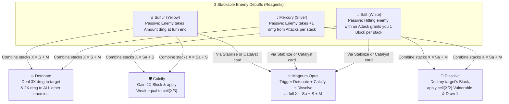

# The Transmuter — Character & Card Pool Design

## 1. Character Identity & Base Stats

- **Name:** The Transmuter
- **Visual Placeholder (v1):** `PlaceholderCharacterModel` (`PlaceholderID = "silent"` for plague-doctor silhouette, amber/gold card frame HSV tint).
- **Starting HP:** `74`
- **Starting Gold:** `99`
- **Energy per Turn:** `3`

---

## 2. Core Mechanic: Reagents & Reactions (*Tria Prima*)

### How Reactions Work
1. **Applying a Same-Type Reagent Stacks Normally:**
   - Playing three Sulfur cards on an enemy stacks **Sulfur** (`3` $\rightarrow$ `6` $\rightarrow$ `10`). Each Reagent has a small passive effect while sitting on an enemy so single-Reagent turns are never wasted.
2. **Applying a Second Reagent Triggers a Reaction (`X = A + B`):**
   - When an enemy with `A` stacks of one Reagent receives `B` stacks of a *different* Reagent, both Reagents are consumed and a **Reaction** fires with potency **`X = A + B`**.
   - *Why `X = A + B` (Full Consumption):* It rewards building up a large stack of one Reagent (e.g., `10 Sulfur`) and then sparking it with a cheap `1 Mercury` primer for a massive `X = 11` Detonation.
3. **How to Trigger the 3-Reagent *Magnum Opus* (`Stabilize` Keyword):**
   - Since any 2 Reagents normally react on contact, how do you get all 3 on an enemy?
   - **Stabilize:** A status you apply to an enemy that **pauses Reactions** until end of turn (or until you play a *Catalyze* card). While Stabilized, you can pile Salt, Sulfur, and Mercury onto the same enemy—when Stabilization ends, all 3 combine into **Magnum Opus**!

---

## 3. Starter Relic & Starter Deck (10 Cards)

### Starter Relic
- **Cracked Alembic:** At the start of combat, apply **2 Sulfur** to a random enemy. The first **Reaction** you trigger each combat grants `[E]` (1 Energy) and draws 1 card.

### Starter Deck (10 Cards)
| Card | Type | Cost | Rarity | Text (Upgrade in parentheses) |
|---|---|---|---|---|
| **Strike** $\times 4$ | Attack | 1 | Basic | Deal 6 (9) damage. |
| **Defend** $\times 4$ | Skill | 1 | Basic | Gain 5 (8) Block. |
| **Brimstone Toss** $\times 1$ | Attack | 1 | Basic | Deal 5 (7) damage. Apply 2 (3) **Sulfur**. |
| **Saline Solution** $\times 1$ | Skill | 1 | Basic | Gain 5 (7) Block. Apply 2 (3) **Salt** and 1 (2) **Mercury** to an enemy *(immediately triggers **Dissolve** for `X = 3 (5)` if un-stabilized!)*. |

---

## 4. Draftable Card Pool — 24 Cards (MVP Set)

### Commons (10 Cards — Bread-and-Butter Applicators & Primers)

| # | Card | Type | Cost | Target | Effect (Upgrade) | Role / Synergy |
|---|---|---|---|---|---|---|
| 1 | **Cinnabar Slash** | Attack | 1 | Enemy | Deal 7 (9) damage. Apply 2 (3) **Mercury**. | Core Mercury attack; sparks Sulfur into **Detonate**. |
| 2 | **Halite Bash** | Attack | 1 | Enemy | Deal 6 (8) damage. Gain Block equal to the target's **Salt**, then apply 3 (4) **Salt**. | Rewards stacking Salt before reacting it. |
| 3 | **Calcination** | Attack | 1 | Enemy | Deal 8 (11) damage. Apply 3 (4) **Sulfur**. | High-rate Sulfur builder. |
| 4 | **Quick Primer** | Skill | 0 | Enemy | Apply 1 (2) **Mercury**. Draw 1 card. | 0-cost spark to detonate an existing Sulfur or Salt stack. |
| 5 | **Salt Ward** | Skill | 1 | Enemy | Gain 7 (10) Block. Apply 2 (3) **Salt**. | Bread-and-butter defensive Salt applicator. |
| 6 | **Fume Cloud** | Skill | 1 | All Enemies | Apply 2 (3) **Sulfur** to ALL enemies. | Sets up multi-target Detonate chains. |
| 7 | **Glass Vial** | Attack | 0 | Enemy | Deal 3 (5) damage. Apply 1 (2) **Salt**. | 0-cost Salt primer to trigger **Calcify** or **Dissolve** for free. |
| 8 | **Distill** | Skill | 1 | Enemy | Double (Triple) a single Reagent on an enemy, only if it has 1 Reagent type. | Turns a 5-Sulfur stack into 10 (15) before you spark it. |
| 9 | **Splash Acid** | Attack | 1 | Enemy | Deal 5 (7) damage. If the enemy has any Reagent, deal 5 (7) damage again. | Efficient frontload damage that rewards keeping a Reagent on target. |
| 10 | **Hermetic Seal** | Skill | 1 | Self/Enemy | Gain 6 (9) Block. Apply **Stabilize** to an enemy for 1 turn. | Common entry point to pause Reactions and stack all 3 Reagents. |

---

### Uncommons (9 Cards — Build-Around Engines, Spread & Co-op Synergy)

| # | Card | Type | Cost | Target | Effect (Upgrade) | Role / Synergy |
|---|---|---|---|---|---|---|
| 11 | **Chain Detonation** | Attack | 2 | Enemy | Deal 10 (14) damage. Apply 3 (4) **Sulfur**. Whenever **Detonate** triggers this turn, apply 2 (3) **Sulfur** to ALL other enemies. | Turns one Detonate into a cascading room-clear. |
| 12 | **Sublimate** | Skill | 1 | Enemy | Convert all stacks of one Reagent on an enemy into another Reagent, then add 3 (5) stacks of it. | Pivots from offense (Sulfur) to defense (Salt) or vice versa. |
| 13 | **Quicksilver Needle** | Attack | 1 | Enemy | Deal 4 (6) damage twice. Apply 1 (2) **Mercury** on each hit. *(Note: 1st hit reacts with existing Sulfur/Salt; 2nd hit leaves fresh Mercury!)* | Multi-hit + leaves a fresh primer behind after reacting. |
| 14 | **Lead to Gold** | Skill | 1 (0) | Enemy | Trigger a Reaction on an enemy with any 2+ stacks of a single Reagent as if 1 **Salt** was applied. Gain 5 (8) Gold. Exhaust. | Self-reacts a single Reagent + meta-scaling gold. |
| 15 | **Volatile Flask** | Attack | 2 | All Enemies | Deal 8 (11) damage to ALL enemies. Apply 2 (3) **Mercury** to ALL enemies. | Triggers **Detonate** or **Dissolve** across the entire room at once. |
| 16 | **Athanor Furnace** | Power | 1 | Self | At the start of your turn, apply 2 (3) **Sulfur** to the enemy with the highest HP. | Passive Reagent generation every turn. |
| 17 | **Residual Precipitate** | Power | 1 | Self | Whenever a **Reaction** triggers on an enemy, reapply 2 (3) stacks of the first Reagent consumed. | Solves the "empty enemy after Reaction" problem so combos keep rolling. |
| 18 | **Sympathetic Tincture** *(Co-op / Debuff)* | Skill | 1 | Enemy | For each unique debuff on the enemy (Weak, Vulnerable, Poison, Doom, etc.), apply 2 (3) **Sulfur**. | Huge payoff in co-op when allies apply Weak/Vulnerable/Poison/Doom. |
| 19 | **Crucible Shield** | Skill | 2 | Self | Gain 12 (16) Block. Whenever you trigger a **Reaction** this turn, gain 4 (6) Block. | Defensive engine for multi-Reaction combo turns. |

---

### Rares (5 Cards — High-Impact Finishers & Capstone Powers)

| # | Card | Type | Cost | Target | Effect (Upgrade) | Role / Synergy |
|---|---|---|---|---|---|---|
| 20 | **The Magnum Opus** | Skill | 2 (1) | Enemy | Apply **Stabilize**, then apply 3 (5) **Salt**, 3 (5) **Sulfur**, and 3 (5) **Mercury**, then immediately detonate **Magnum Opus**. Exhaust. | Signature 1-card Grand Transmutation finisher (`X = 9 (15)` + any existing stacks). |
| 21 | **Philosopher's Engine** | Power | 3 (2) | Self | Your **Reactions** trigger **twice**. | Capstone build-around Power. |
| 22 | **Universal Solvent (Alkahest)** | Attack | 2 | All Enemies | Deal 12 (16) damage to ALL enemies. Remove all Artifact and Block from ALL enemies, then apply 3 (4) **Salt** and 3 (4) **Mercury** to ALL enemies. | Strips Artifact/Block and immediately fires **Dissolve** across all enemies. |
| 23 | **Nigredo, Albedo, Rubedo** | Skill | 1 | Enemy | Choose 1 of 3 generated 0-cost cards to add to your hand: **Nigredo** (Apply 6 (8) Salt), **Albedo** (Apply 6 (8) Mercury), or **Rubedo** (Apply 6 (8) Sulfur). | Flexible modal card that always gives you the exact Reagent you need. |
| 24 | **Emerald Tablet** | Power | 2 | Self | Whenever you apply a Reagent, apply +1 (+2) additional stack. | Multiplies every applicator card in your deck. |

---

## 5. Additional Relics (Pool)

1. **Starter — Cracked Alembic:** Start combat with 2 Sulfur on a random enemy; first Reaction each combat gives `[E]` and draws 1.
2. **Uncommon — Ouroboros Ring:** Whenever an enemy dies while it has any Reagents, transfer those Reagents to a random living enemy.
3. **Rare — Paracelsus'sScalpel:** **Reactions** no longer consume the last 1 stack of each Reagent.

---

## 6. Open Design Decisions for You

1. **Reaction Consumption (`X = A + B`):** Do you like **Full Consumption** (applying 1 Mercury to 10 Sulfur consumes both and fires **Detonate** for `X = 11`), or would you prefer **Residue** (consumes all stacks, or leaves 1 stack behind)?
2. **How *Magnum Opus* (3-Reagent Reaction) is reached:** Do you like the **Stabilize** keyword (pauses 2-Reagent reactions for the turn so you can pile all 3 onto one target for a mega-explosion), or would you rather keep it simpler (no Stabilize; Magnum Opus only happens from specific Rare/Uncommon Catalyst cards)?
3. **Any specific cards you want to add, swap, or tweak** before I scaffold the `Transmuter` C# project and push it to `amattapalli/sts2-mod`?
